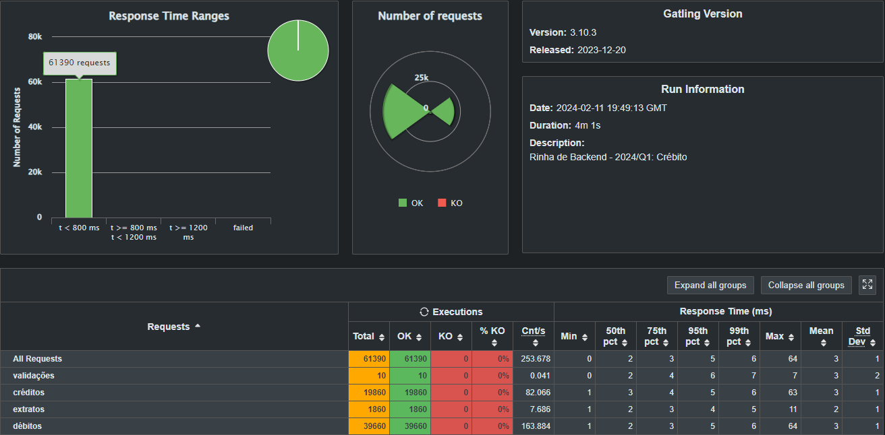

# Submissão para Rinha de Backend, Segunda Edição: 2024/Q1 - Controle de Concorrência

  
  
  

## Cleiton Rodrigues Nunes

Submissão feita com:

- `haproxy` como load balancer
- `postgres` como banco de dados
- `golang` como linguagem de programação da API

## Resultados

[Repositório](https://github.com/cleitinif/rinha-de-backend-2024-q1)

## Contato

[Linkedin](https://www.linkedin.com/in/cleiton-nunes)
